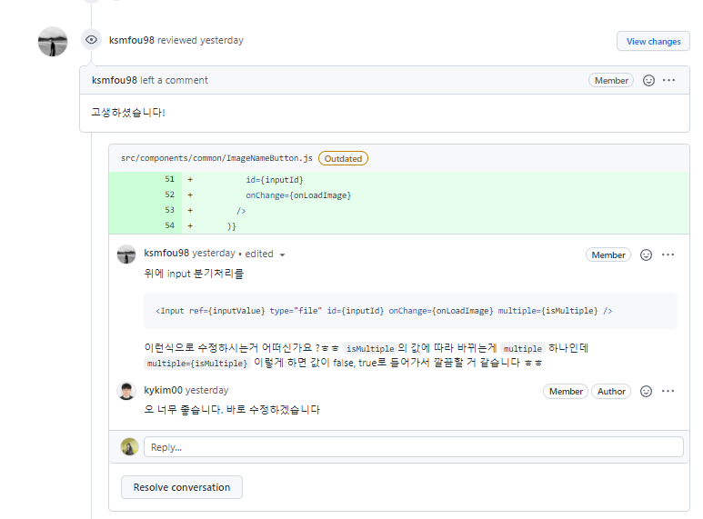
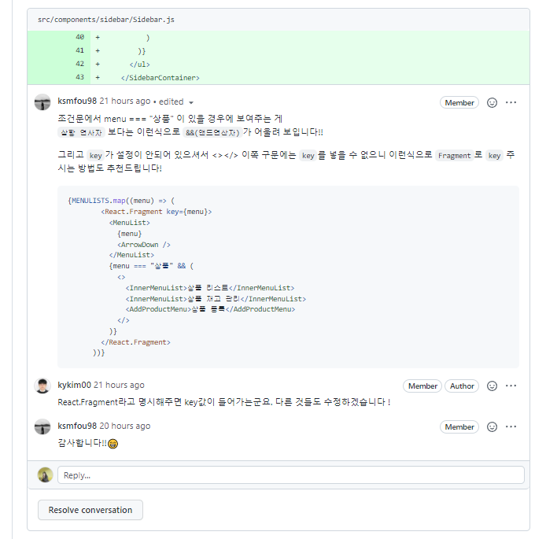
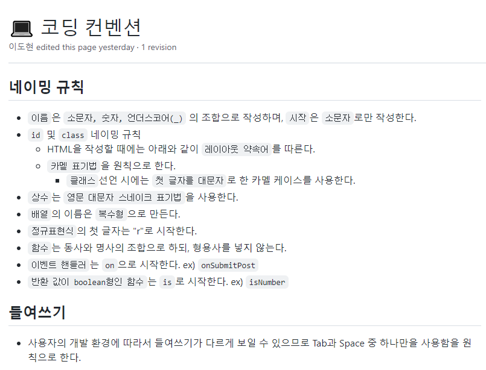
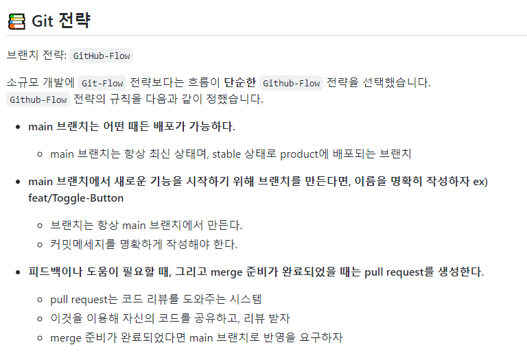

# 📝원티드 프리 온보딩  2번째 과제 

## 설로인 - 상품 등록 페이지 구현 


## 🧾 목차

  - [배포링크](#배포링크) 

  - [프로젝트 소개](#프로젝트 소개 )

  - [팀원 소개](#팀원 소개)

  - [프로젝트 과정 소개](#프로젝트 과정 소개)

  - [기능 목록 명세](#기능 목록 명세)

  - [프로젝트 설치 및 시작](#프로젝트 설치 및 시작)

    
## 📌배포 링크

* [배포링크](https://fervent-swirles-416dd0.netlify.app/)


## 📌프로젝트 소개 
* 설로인의 관리자 페이지, 상품의 신규 등록 또는 수정하는 영역의 페이지를 구현
* Recoil로 전역 상태 관리
* datepicker를 제외한 UI 라이브러리를 사용하지 않고 구현
* 공용 컴포넌트 사용을 통한 코드 재사용성과 작업 효율성 향상


## 📌팀원 소개

<table align="center">
<tr>
<td align="center"><a href="https://github.com/perfumelim"></a></td>
<td align="center"><a href="https://github.com/kykim00"></a></td>
<td align="center"><a href="https://github.com/ksmfou98"></a></td>
<td align="center"><a href="https://github.com/yezyvibe"></a></td>
</tr>
<tr>
<td align="center"><b> 임향수 (팀장)</b></td>
<td align="center"><b>김기영</b></td>
<td align="center"><b>이도현</b></td>
<td align="center"><b>조예지</b></td>
</tr>
<tr>
<td align="center"><b>FE Developer</b></td>
<td align="center"><b>FE Developer</b></td>
<td align="center"><b>FE Developer</b></td>
<td align="center"><b>FE Developer</b></td>
</tr>
</table>


## 📌프로젝트 과정 소개

|                팀원 간 코드 리뷰를 통한 소통                 |                팀원 간 코드 리뷰를 통한 소통                 |
| :----------------------------------------------------------: | :----------------------------------------------------------: |
|  |  |


|             코딩 컨벤션 약속을 통한 코드 통일성              |                     Git 커밋 컨벤션 정의                     |
| :----------------------------------------------------------: | :----------------------------------------------------------: |
|  |  |


## 📌기능 목록 명세

### ✔  담당자 : 김기영

- 노출 및 판매기간 설정
- 이미지 추가 기능 : 이미지 미리 보기, 다중 선택 기능
- 메뉴바 구현

### ✔  담당자 : 조예지

- 상품 기본 정보 등록
  - 카테고리 리스팅 설정
  - 태그 설정 : 검색어에 따른 태그 필터링, 설정 및 해제
  - 상품명 입력
  - 상품 구성 소개 정보 입력
  - 상품 이미지 등록 : 상품 썸네일 및 대표 이미지 등록
  - 상품 총 재고량 표시

### ✔  담당자 : 이도현

- 상품 옵션 등록
  - 이미지 첨부
  - 옵션명, 가격, 재고 과세 표시 설정
  - 옵션 세트 추가 버튼 탭 시 추가옵션 등록 sell 추가
- 이미지 추가 
  - 상품 소개 이미지 추가
  - 구매자 추천 이미지 추가

### ✔  담당자 : 임향수

- 상품 정보 고시 

  - 제품명, 원산지, 등급, 보관 식품 유형 등 입력, 기타 항목 추가 가능
  - 정보고시 추가를 통해 정보고시 항목 추가 가능
  - 기존 정보 공시 항목 외 새로운 항목이 추가됐을 때만 삭제 버튼 등장

- 상품 배송 설정

  - 사용자 배송일 출발일 지정 / 방문 수령 / 선 주문 예약 배송 중 선택 가능
  - 선 주문 예약 배송 선택 시 날짜 선택 가능

- 상품 혜택 및 기타 설정 

  * 토글로 on / off 선택 가능

  

## 📌프로젝트 설치 및 시작


### 프로젝트 클론
```bash
$ git clone https://github.com/2201infinity/adm_product_add.git
```


### 패키지 설치

```bash
$ npm install or yarn
```


### 서버 실행

```bash
$ npm run start or yarn run start
```


